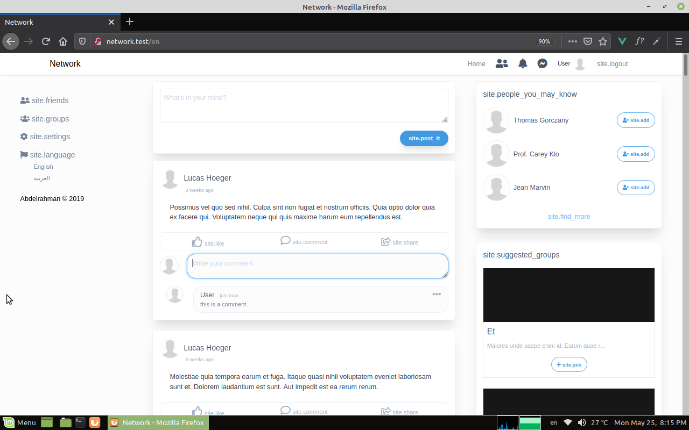

# network
Social Network Project for practicing

Still in progress...

## Some Features
* The project is built with laravel, javascript, jquery, ajax, and tailwind
* where a user can create, update, delete, like and share posts.
* They can add, update and delete comments.
* They  can also send and accept friend requests, join groups and follow pages.
* All using eloquent relationships.
* And furthermore, unit testing is applied to all the functionalities.
* There are other great features still in progress.

